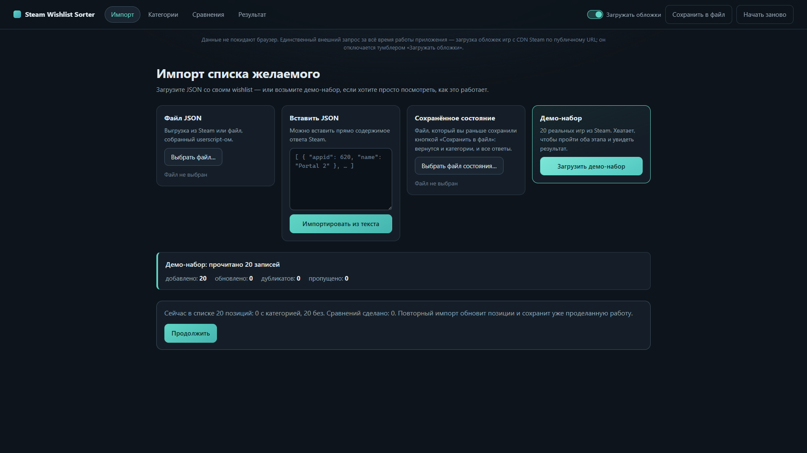
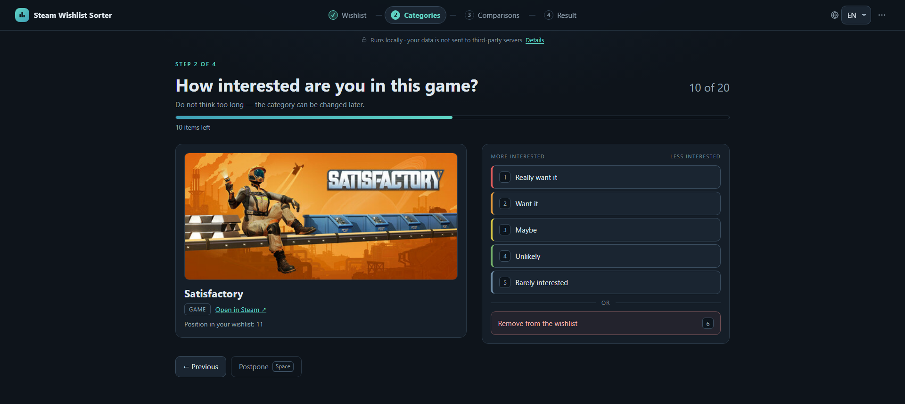
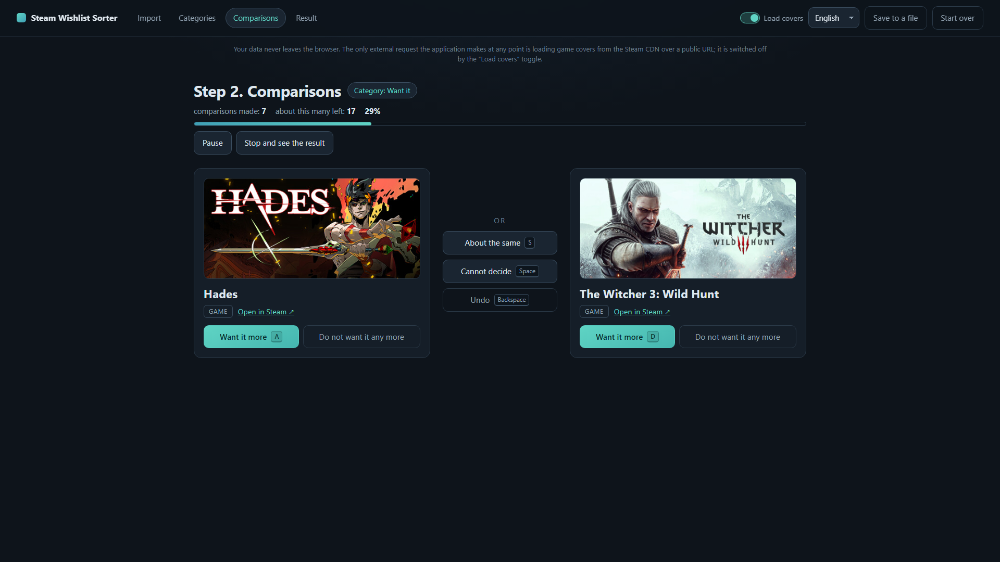
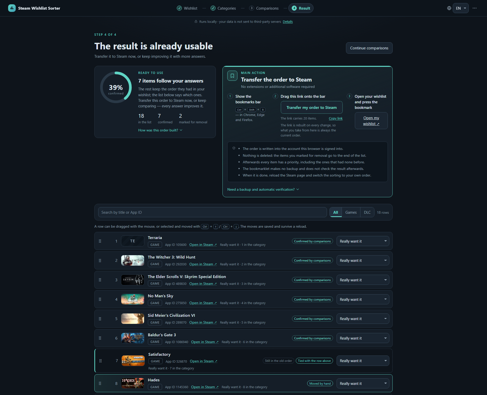

# Steam Wishlist Sorter

[](https://github.com/Akynin99/Steam-Wishlist-Sorter/actions/workflows/test.yml)
[](LICENSE)

**A local web application that turns a 200+ entry Steam wishlist into an honestly ordered list —
through pairwise comparisons, with no server and with nothing sent anywhere.**

🎮 [Live demo](https://akynin99.github.io/Steam-Wishlist-Sorter/)
(the demo set is already inside, you do not have to load a wishlist of your own)



The interface is bilingual: **English by default, Russian as the second language**, switched in the
header. Nothing is lost when the language changes — not one answer and not the place in the sorting.

---

## Why this exists

A wishlist grows for years, and the question is always the same: **what do I buy right now?**
Steam sorts it by price, by discount and by the date it was added — by everything except how much
you actually want to play the thing. Steam does have a manual order, but arranging two hundred
entries by dragging is impossible: to put a game in its place you have to hold the whole list in
your head.

The obvious answer — "rate every game from 1 to 10" — does not work, for three reasons:

- **ratings drift.** The first twenty entries get eights and nines, by the hundredth the bar has
  moved, and the ratings from the top and from the bottom of the list are no longer comparable;
- **the scale clumps.** Over 200 entries and 10 steps, every step holds a couple of dozen games,
  and inside a step there is no order at all — which means the problem is not solved;
- **an absolute rating is a hard question.** "How much do I want Hades, out of ten?" asks you to
  keep the rest of the list in mind.

A pairwise question is one a human answers fast and confidently: **"Hades or Hollow Knight?"**
No scale is needed, no context, and the answer does not drift over time. A thousand answers like
that produce an order no ten-point scale can give you.

The rest is arithmetic. Comparing everything with everything over 200 entries is 19,900 questions,
and nobody gets through that. The application asks about a thousand: the list is first split coarsely
into six buckets of desire, and inside a bucket a binary insertion runs on top of a preference graph
that derives everything already implied by the answers given (see [Architecture](#architecture)).

| The categories screen | The comparisons screen | The final list |
| --- | --- | --- |
|  |  |  |

---

## Live demo

<https://akynin99.github.io/Steam-Wishlist-Sorter/>

It is the same application, published as static files through GitHub Pages. Press **“Load the demo
set”** on the import screen — a set of 20 games is inside, enough to walk all three stages, and no
wishlist of your own is needed for that.

> **Your data stays in your browser.** The demo is a static page: it has no backend, so there is
> nothing to send your work with and nowhere to send it. Everything you import lives in the
> `localStorage` of your browser and disappears with the “Start over” button or along with the site
> data. The details are in [Privacy](#privacy).

For regular work on your own list it is better to run the application locally: the same files, but
the state then lives in the `localStorage` of a local address and does not mix with the demo.

---

## Running it

ES modules do not load over the `file://` scheme, so the application is opened from an HTTP address.
The server ships with the project — `server.js`, plain Node, without a single dependency.

**Windows:**

1. Install [Node.js](https://nodejs.org/) 20 or newer (development happens on 24 LTS).
2. Run `start.bat` with a double click.
3. The browser opens <http://localhost:8080/> by itself. If it does not, type the address by hand.

Another port: `start.bat 9000`. If Node is not installed, `start.bat` tries to bring up the built-in
Python server on the same port, and if that is missing too, it says so honestly instead of flashing
a black window.

**Any other system:**

```bash
node server.js
```

and open <http://localhost:8080/>.

**Tests:**

```bash
node --test
```

Neither `npm install` nor `npx` is needed: the project has no third-party dependencies and never
will, and the tests are written on the built-in `node:test` and `node:assert`. GitHub Actions runs
the same tests on every push and pull request.

---

## Language of the interface

The switch sits in the header, next to the covers toggle. **English is the default, always** — the
browser language is deliberately not consulted, so the demo opens the same way for every visitor.
The choice is stored next to the other settings and survives a reload; a state file saved before the
interface became bilingual reads as English.

Switching the language redraws the screens and touches nothing else: the answers, the categories,
the manual moves and the exact place in the sorting stay where they were. The exports follow the
language too — see [What comes out](#what-comes-out).

---

## Getting the wishlist out of Steam

The repository holds two userscripts. The first one is the one that exports the list.

### Step 1. Install Tampermonkey

[Tampermonkey](https://www.tampermonkey.net/) is an extension that runs user scripts on pages. It
exists for Chrome, Edge, Firefox and Opera. Violentmonkey does the job as well.

In Chrome and Edge you have to turn on developer mode in `chrome://extensions`
(`edge://extensions`) once — without it the extension cannot execute userscripts.

### Step 2. Install the script

Open [`userscripts/steam-wishlist-export.user.js`](userscripts/steam-wishlist-export.user.js) and
press **Raw** — Tampermonkey offers the installation itself. Or copy the contents of the file and
paste them into the Tampermonkey editor (“Create a new script”).

### Step 3. Collect the list

1. Open your wishlist: <https://store.steampowered.com/wishlist/>
   (Steam redirects to an address like `/wishlist/profiles/<your SteamID64>/`).
2. A **“Wishlist Sorter — export”** panel appears in the bottom right corner. Press
   **“Collect the list”**.
3. The page starts scrolling by itself — that is how Steam loads the entries, they are not all in
   the markup at once. Do not touch it while the collection runs. Two hundred entries take about a
   minute.
4. The script shows a report: how many entries were collected, how many scroll steps it took and
   whether the result disagrees with the number Steam shows itself. Press **“Download JSON”**.

### Step 4. Load the file into the application

On the import screen, **“JSON file”** — pick the downloaded file. That is it, the categories are next.

Importing again **does not erase the work**: entries are matched by App ID, the categories and the
comparison answers are kept, and only the titles, the covers and the wishlist positions are
refreshed. So a month later you can export the list again and continue from the same place.

### What the script does and does not do

- it collects the App ID, the title, the link, the cover URL, the current position in the wishlist
  and the type (game / DLC / `unknown` when the page carries no mark — the type is never guessed);
- it **makes no network request at all**: no `fetch`, no `XMLHttpRequest`; the header says
  `@grant none` and there is not a single `@connect`;
- it does not read cookies, and does not touch `sessionid`, tokens or any other secret;
- when the Steam selectors do not match, it shows a readable message and stops. An empty or
  knowingly incomplete file is never handed over silently: incompleteness is always in the report.

---

## When the userscript stops working

Steam changes the layout of the wishlist, and one day the selectors will break. The list can still
be obtained — the application accepts several JSON shapes.

### Way 1. The public wishlist endpoint

Open it in the browser directly, with your own SteamID64:

```
https://api.steampowered.com/IWishlistService/GetWishlist/v1?steamid=76561198000000000
```

The browser shows JSON. Save the page as a file (`Ctrl+S`) and load the file into the application.

There is also an older endpoint with richer data — titles and covers right there in the answer; in
places it no longer responds, but when it does, the application understands its format as well:

```
https://store.steampowered.com/wishlist/profiles/76561198000000000/wishlistdata/?p=0
```

Two caveats, both important:

- **the wishlist has to be public** in the privacy settings of the Steam profile, otherwise the
  endpoint returns nothing;
- **that address cannot be pulled into the application automatically** — CORS. Steam does not give
  our page the header that would let it read another domain from the browser, and working around
  that through a proxy would mean sending your wishlist to somebody else's server. So it goes
  through a file: open, save, load.

The new endpoint returns **App IDs and priorities only**, without titles. That is fine: the
application shows such entries as `App 1086940`, builds the store link itself and takes the cover
from the public URL of the Steam CDN — you recognize the game by its picture. And if you later
export the list with the userscript and import it on top, the titles land on the same entries and
nothing is lost.

### Way 2. Paste the JSON as text

The import screen has a **“Paste JSON”** field — the body of the answer can go there without saving
a file. Understood are: an array of objects, an array of bare App IDs, an object shaped like
`{ "440": { … } }`, `{ response: { items: [...] } }` and the application's own export.

Everything that could not be read lands in the import report with a reason — an import does not
fail as a whole because of one malformed record.

---

## How to use it

1. **Import.** A file, text, the demo set or a state file.
2. **Categories.** Six buckets by the strength of the desire — from “Really want it” to “Barely
   interested”, plus “Remove from the wishlist”. Keys `1`–`6`, `←` for back, `→` or space to
   postpone. The stage can be skipped and everything compared in one heap, but with categories there
   are noticeably fewer questions: an entry from “Really want it” is never compared with an entry
   from “Unlikely”.
3. **Comparisons.** One question, two games. The answers are “this one”, “that one”, **“about the
   same”** (a tie) and **“cannot decide”** (the pair is postponed, it comes back later — and often
   it does not have to, because the order follows from other answers). The last answer can be undone.
4. **Result.** A numbered list with a filter by category, a search, draggable rows and the exports.

### The sorting can be abandoned halfway

That is by design, not something that “happens to work”. A thousand comparisons are not done in one
sitting, and a tool that gives nothing until the very end is useless.

The “Result” screen is available from the first minute and always gives a meaningful list:
everything that already follows from the answers stands in the derived order, and the rest stands in
the fallback one, by the position in your wishlist. Every row is marked with where its place comes
from:

- **confirmed by comparisons** — the order with both neighbours follows from your answers;
- **fallback order** — the comparisons have not reached this row yet;
- **by hand** — you dragged the row here yourself.

The summary on top says honestly which part of the list is already ordered and which part simply
stands by seniority.

### Where the state lives and how to back it up

The state is written into the `localStorage` of the browser under the key
`steam-wishlist-sorter/state` after every action. Close the tab, turn the computer off, come back a
week later — the application opens where you left it and offers the same question.

What matters about `localStorage`: it is tied to **the browser and the address**
(`http://localhost:8080` and the demo on GitHub Pages are different stores), it lives on one machine
and it is erased along with the site data. That is why the application has a **“Save to a file”**
button (and its twin, “Backup of the state”, on the result screen): it writes the whole state out —
the list, the categories, the answers, the manual moves — as one JSON.

That file is both a backup and a way to move: on another machine, open the application and load it
through **“Saved state”** on the import screen. Loading a state replaces the current work whole, so
the application asks for a confirmation.

Make a copy before you clear the browser data or change machines: it is the only way not to lose the
comparisons you have made.

---

## What comes out

The buttons on the “Result” screen:

| Button | What it gives | What for |
| --- | --- | --- |
| **Order as JSON** | `wishlist-order-YYYY-MM-DD.json` | the machine readable order: position, App ID, category, place in the category, where the order comes from, the ties and a separate “remove” list. The second userscript reads it |
| **List as CSV** | `wishlist-order-YYYY-MM-DD.csv` | a table for Excel, Google Sheets, LibreOffice |
| **Copy as a list** | text on the clipboard | a numbered list — to drop into a note or into a chat with a friend |
| **Backup of the state** | the full state dump | to continue the work on another machine |

The files a human reads follow the language of the interface: the CSV header, the category names and
the type of every entry are written in it, and so is the `categoryLabel` field of the JSON. The ids
never move — `category`, `origin` and `kind` stay the machine readable values they always were, so
a file exported in one language is read by the second userscript exactly like a file exported in the
other.

### Why the CSV separator follows the language

In English the separator is a **comma**, exactly as
[RFC 4180](https://datatracker.ietf.org/doc/html/rfc4180) asks for. In Russian it is a
**semicolon** — a deliberate departure from the standard, and for a concrete reason: when Excel
opens a `.csv` on a double click, it does not read the file by the RFC, it splits it by the **list
separator of the system locale**, and in the Russian (as well as the German and the French) locale
of Windows that is a semicolon. A comma separated file opens there as one single column, and the
user goes off to fight with the import wizard — which means the table the whole thing was for did
not open.

Every other tool — LibreOffice, Google Sheets, `pandas`, the `csv` module of the standard library —
takes the separator as a parameter, and for them this is one extra argument. So the compromise is
made in favour of Excel on the user's own locale, and it is a compromise, not conformance.

For the same reason there is a BOM at the start of the file: without it Excel reads a `.csv` in the
system ANSI code page and every non-Latin title turns into mojibake.

---

## Carrying the order back into Steam

The second userscript —
[`userscripts/steam-wishlist-import-order.user.js`](userscripts/steam-wishlist-import-order.user.js)
— takes the “Order as JSON” file and **shows** on the wishlist page where each entry has to go.

It is installed the same way as the first one. Then: open the wishlist → the panel in the bottom
right corner → pick the file.

The script first reads the page and shows a report:

- how many entries of the file were found on the page and how many were not (usually the missing
  ones are those already bought or taken off the list);
- whether the page holds duplicates;
- which entries appeared in the wishlist after the export — the script does not touch their places;
- how many entries are marked for removal;
- the whole target order: a line can be clicked, and the page scrolls to that game.

**Nothing on the page changes before an explicit confirmation.** On the “Show the order on the page”
button the script draws marks on the rows: blue is the target number, red is “remove from the
wishlist”, grey is “not in the file”. The marks live until a reload and touch no data.

The matching goes **strictly by App ID**; the titles are shown for you to read, nothing more.
The file is checked by its `kind` field, so a state dump is never mistaken for an order file — the
script says that a different export is needed.

### Why the arranging is not automated

Openly, because this is the main limitation of the project.

The only supported way to set your own order in Steam is to **drag the rows with the mouse** on the
wishlist page (with the sorting by your own rank and the filters cleared). Steam provides no
programmatic interface for “arrange the list like this”; a move goes to the server as a request that
carries `sessionid` — the session token of the logged-in user.

Automating that would mean **reading the session token out of the page** and **sending writing
requests to Steam on your behalf**. This project does neither — not in the userscript, not anywhere
else. On top of that the list is virtualized (rows are reused while scrolling), so a script
imitating two hundred drags would almost certainly break somewhere in the middle and leave the
wishlist in a state nobody asked for.

A tool that has arranged half of a 200 entry list and cannot say where it stopped is worse than no
tool at all. So instead of imitating a working solution there is a preview mode: a report,
highlighting and instructions. You do the dragging, and the script never presses the save button.

---

## Architecture

Vanilla JS, ES modules, no frameworks, no bundler, no transpilation. Node is needed only for the
tests and for the local server. There is not a single third-party dependency, neither at runtime nor
in development.

### Modules

| File | What for |
| --- | --- |
| [`src/model.js`](src/model.js) | the model of an entry (`appId`, title, link, cover, position in the wishlist, type), the six categories, the normalization of anything into that model. It knows about neither the DOM nor the storage |
| [`src/i18n.js`](src/i18n.js) | the two dictionaries and the lookup around them: `t()`, the plural forms, the current language. No DOM either, so it is tested directly — including the test that the sets of keys of the two languages match exactly |
| [`src/import.js`](src/import.js) | bringing arbitrary JSON to the model: five shapes on the input, a report with reasons on the output. Merging by `appId`, so a repeated import breeds no duplicates and erases no work |
| [`src/storage.js`](src/storage.js) | `localStorage` behind a wrapper: autosave, the export and import of the state as a file, the check of the signature and of the format version. It does not depend on the DOM — a test replaces it with an in-memory stub |
| [`src/ranking.js`](src/ranking.js) | the core: the preference graph, the pair scheduler, the layer of manual moves, the building of the result. All the ranking logic lives here, and the interface does not duplicate it |
| [`src/export.js`](src/export.js) | the result as JSON, CSV and text. No DOM — which is why every format is checked by a test character by character, instead of by eye in a downloaded file |
| [`src/ui-*.js`](src/) | the screens on top of the core: import, categories, comparisons, result, the shared frame of the application and the confirmation dialog |
| [`server.js`](server.js) | a static server on plain Node: it serves the files of the project and is guarded against escaping the root |
| [`userscripts/`](userscripts/) | two Tampermonkey scripts: the wishlist export and the preview of carrying the order back |

### The algorithm: a preference graph, not a merge sort

The obvious move is to take a ready merge sort and put a question to the user into the comparator.
That must not be done, and here is why.

A merge sort **has to know the outcome of the current comparison** to continue merging. And the
application needs two answers a comparator never has:

- **“about the same”** — that is not “less”, not “greater” and not “equal” in the sense of sorting:
  the order that comes out is non-strict, with groups of equal elements;
- **“cannot decide”** — the pair has to be postponed and the work has to **go on**, while a merge
  sort simply stalls at that point.

Plus two practical requirements: undoing the last answer, and removing an entry from the list in the
middle of the process. For a merge sort both mean starting over.

So the source of truth is a **graph**:

- an edge `A → B` means “A is above B”;
- a disjoint-set structure (union-find) holds the groups of entries declared equal;
- the transitive closure is kept as bit masks of ancestors and descendants, so “what do we already
  know about this pair” is a constant time lookup — and the scheduler asks that thousands of times
  per session.

Everything needed follows from the graph by itself: transitivity (a pair implied by the answers
already given is never asked about), undo (an answer is thrown away and the history is replayed),
the removal of an entry (a node disappears), the ties (nodes merge into one group).

On top of the graph runs the **scheduler** — a binary insertion, separately in every category: the
entries already placed form a chain, the next entry is inserted into it by binary search, and every
probe is addressed to the graph first. A question reaches the user only for the probe the graph
cannot answer. Hence O(n log n) questions instead of the O(n²) of the naive sweep.

A postponed pair does not stop the scheduler: the entry that needs it is skipped, the next one is
inserted, the chain grows — and most of the time the postponed pair stops being needed at all. If
every remaining question is postponed, the scheduler reports the deadlock and shows the first
postponed pair as unavoidable.

The whole state is the entries, their categories and an **append-only history of actions**. The
graph, the groups, the queue of postponed pairs and the position of the scheduler are derived from
it by a deterministic replay. That is why saving the state loses nothing, and after a reload the
application asks exactly the question it asked before it.

### The manual order as a separate layer

The most interesting decision in the project. A row of the final list can be dragged with the mouse
— and that is not the same thing as an answer to a comparison.

**An answer is a statement about a pair.** It goes into the graph, which is append-only and has to
stay free of contradictions. **A drag is a statement about the list.** It may perfectly well
contradict an answer given ten minutes ago: you are looking at a finished list and seeing what you
could not see while answering a single question.

Sending a drag into the graph would mean either refusing the user their own move or deleting edges
from the graph. Both are worse than keeping the two layers apart. So a manual move is stored as

```js
{ appId, anchor, side }   // "this entry goes right after / before that one"
```

and the moves are replayed **on top of** the order the comparisons produce, in the order they were
made. A place is remembered relative to a neighbour, not as a number: the list is renumbered after
every new answer, while “right after Portal 2” always means the same thing.

The consequences are all intentional:

- new answers keep improving the list, while the manual arrangement is laid over them and is not
  erased by them;
- a move whose anchor has left for another category is not lost — it simply stops applying until the
  anchor comes back, exactly like an answer about a pair that no longer exists;
- where a move argues with the comparisons, the move wins, but the row is marked “moved by hand” and
  is not passed off as a result of the sorting;
- the scheduler is unaffected: it goes on asking the same questions, because a drag never claimed to
  answer one of them.

The manual edits are reset by a button of their own, without touching the comparison answers.

---

## Privacy

- Nothing is sent anywhere: **no server, no backend, no analytics, no cookies, no tokens.**
  `server.js` only hands the files of the application to the browser and accepts nothing from it.
- The whole state lies in the `localStorage` of your browser, on your machine, and is erased by the
  “Start over” button or by clearing the site data.
- **The only external request the application makes at any point is loading game covers from the
  Steam CDN over a public URL.** It is switched off by the “Load covers” toggle in the header; with
  the toggle off, the application does not reach outside at all.
- The userscripts make no network requests whatsoever: `@grant none`, not a single `@connect`. They
  read neither cookies, nor `sessionid`, nor any other secret.
- The same holds for the demo on GitHub Pages: the very same static files, only on somebody else's
  hosting. Your data stays in your browser — there is nobody to send it to and nothing to send it
  with.

The wording “no external requests”, without the note about the covers, would be untrue, which is why
it is not here.

---

## Limitations

- **The order is not carried into Steam automatically.** There is no supported mechanism, and the
  project will not imitate one through a session token and writing requests. The second userscript
  works in preview mode: a report, highlighting and instructions; the dragging is yours. In detail —
  in [“Why the arranging is not automated”](#why-the-arranging-is-not-automated).
- **The Steam selectors will break one day.** The layout of the wishlist has changed more than once,
  and the obfuscated class names of the newer page change by themselves. When that happens, the
  script says “not a single item was found on the page” and stops — it will not hand over a silently
  empty file.

  It is fixed in one place: the `STEAM` object at the top of
  [`steam-wishlist-export.user.js`](userscripts/steam-wishlist-export.user.js). The comment above it
  spells out the procedure: open the wishlist, `Inspect` a row with a game, find the element that
  wraps the whole row and add its selector first to `rows`; extend `titles`, `images` and `scrollers`
  if needed. Every field is a list of candidates tried in order, so the old values can stay. The last
  line of defence is the fallback parsing by `/app/<id>/` links, which survives almost any change of
  class names. **The same object is duplicated in the second userscript** — both files have to be
  updated: a userscript is loaded by Tampermonkey as a file of its own, and there is nowhere to pull
  a shared module in from.
- **The type of an entry is not always known.** When the page shows no “DLC” mark, the type stays
  `unknown` — the script does not guess it, so that no invented data goes into the file.
- **The public endpoint gives App IDs only.** The application builds the titles and the covers
  itself; for the real titles you need the userscript or a later import on top.
- **One browser, one state.** There is no synchronization between machines and none is planned: that
  would mean a server. Moving happens through the state file.

---

## Repository layout

```
index.html                 the entry point of the application
styles.css                 the styles, a dark theme
server.js                  the local static server on plain Node
start.bat                  the launcher for Windows (Node, with Python as a fallback)
src/                       the source: model, i18n, import, storage, ranking, export, screens
tests/                     the tests on node:test; tests/fixtures — the demo set and test data
userscripts/               two Tampermonkey scripts for the Steam page
docs/screenshots/          the screenshots for the README
.github/workflows/         CI: node --test on push and on pull request
```

## License

[MIT](LICENSE)
